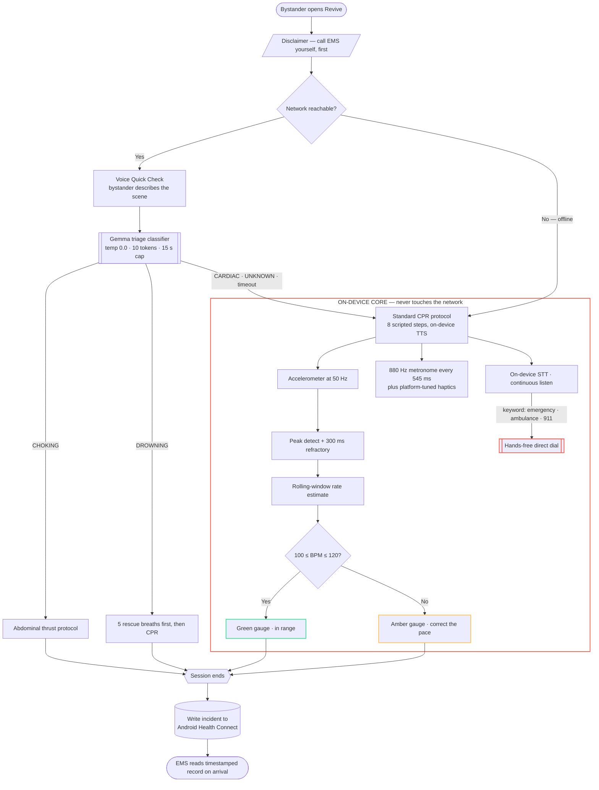
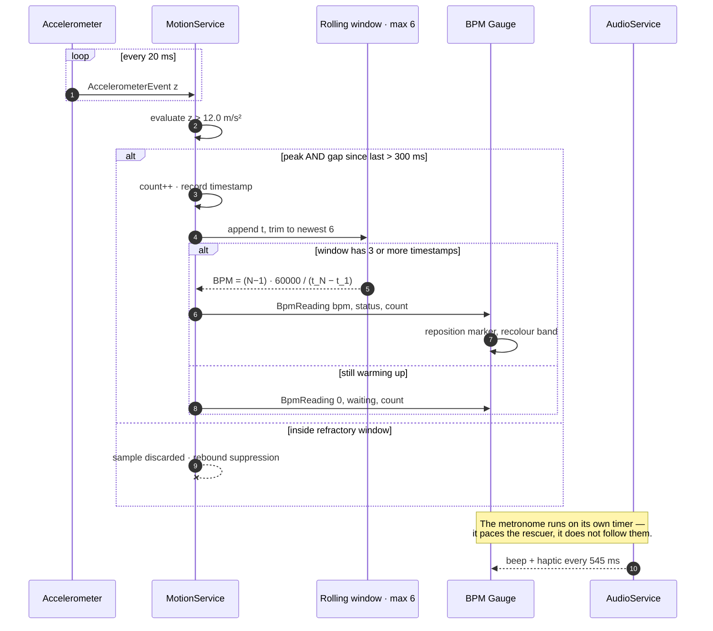
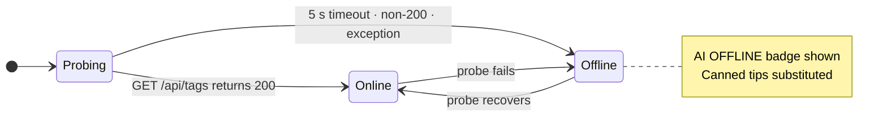
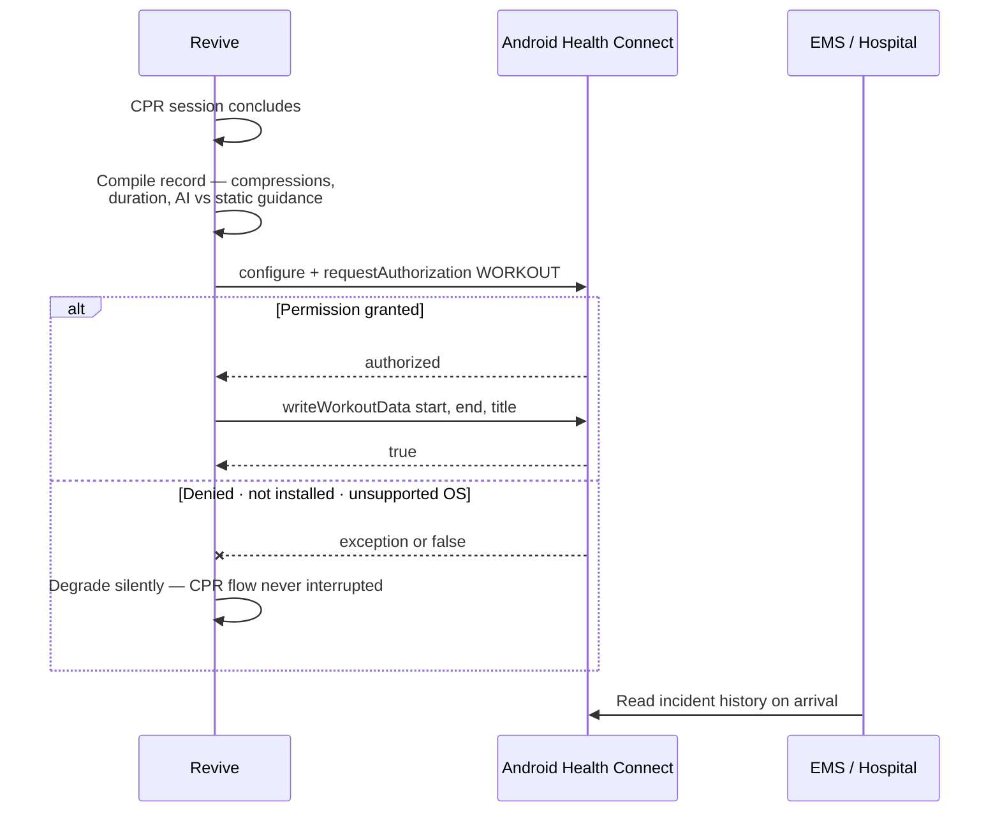

# REVIVE

### A hybrid edge-AI cardiac emergency response system

**Coaching bystanders through CPR in the critical minutes before EMS arrives.**

> [!WARNING]
> **This app augments a rescue. It never replaces one.**
> Always call emergency services yourself, first. See [Disclaimer & Liability](#disclaimer--liability).

---

## Executive Summary

Revive is built for exactly the situation most CPR apps ignore: **the connectivity gap**. Rural areas, disaster zones, basements, and crowded venues all have the same problem — no reliable signal at the moment someone collapses. Revive's core life-saving path never depends on a network connection to work.

Most CPR-coaching demos wire an LLM into the compression loop for narration, then call it done. Two things about that don't hold up:

**1. The life-saving logic doesn't need an LLM.** Counting compressions and judging rhythm against a 100–120 BPM target is a threshold check on accelerometer data — arithmetic, not intelligence. An LLM sitting in that path just adds latency and a failure mode.

**2. "Offline" and "cloud-dependent LLM" are contradictory claims.** If your AI runs through a tunnel to a machine somewhere else, the app is not offline — it's hoping the network holds.

Revive is honest about both, uses the LLM only where it earns its place, and falls back to a rock-solid offline core.

> ### The design principle
> **AI is additive, never load-bearing.** Every AI-dependent screen rechecks connectivity and fails *toward* the safe static default rather than stalling. An unreachable tunnel skips straight to canned guidance instead of waiting out a timeout. Uncertain triage routes to standard CPR.

---

## System Workflow



**The boundary is the whole point.** Everything inside `ON-DEVICE CORE` runs with the radio off. The two AI touchpoints — triage on entry, Q&A during compressions — sit outside it, and both have a defined fallback that keeps the rescuer moving.

---

## Signal Pipeline

How a physical push on someone's chest becomes a number on screen:



Two decisions worth calling out:

- **The refractory window is rebound suppression, not smoothing.** A single chest compression produces one downward spike *and* a recoil spike. Without the 300 ms lockout, every compression counts twice and the displayed rate doubles.
- **The metronome is open-loop.** It never speeds up or slows down to match the rescuer. If it chased the measured rate it would happily lock onto a wrong rhythm and reinforce it.

---

## Degradation Model

The app probes the AI tunnel on entry and then every 20 seconds. Neither state blocks CPR coaching.



| Capability | Online | Offline |
|---|:---:|:---:|
| Compression counting & BPM | Yes | Yes |
| Rhythm coaching (metronome + haptics) | Yes | Yes |
| 8-step CPR protocol via on-device TTS | Yes | Yes |
| Voice-activated emergency dialing | Yes | Yes |
| Health Connect incident logging | Yes | Yes |
| Bystander triage (choking / drowning branch) | Yes | No — defaults to standard CPR |
| Conversational Q&A | Yes | No — canned reminders |

---

## The Math

Every formula below is the one the code actually executes — file references included.

### 1. Compression detection

A compression is registered at sample time $t$ when both conditions hold — [`motion_service.dart:60`](lib/services/motion_service.dart#L60):

$$
z(t) > \theta \quad \wedge \quad t - t_{\text{last}} > \tau_{\text{ref}}
$$

| Symbol | Value | Meaning |
|---|---|---|
| $\theta$ | 12.0 m/s² | Z-axis magnitude gate (gravity alone is ≈ 9.81) |
| $\tau_{\text{ref}}$ | 300 ms | Refractory period — suppresses the recoil spike |
| $\Delta t_{\text{sample}}$ | 20 ms | Accelerometer sampling period → 50 Hz |

The refractory period imposes a hard ceiling on what the app can *physically* count:

$$
\mathrm{BPM}_{\max} = \frac{60000}{\tau_{\text{ref}}} = \frac{60000}{300} = 200
$$

which is exactly where the gauge track ends. At the 110 BPM clinical target, one compression arrives every ≈ 545 ms — comfortably clear of the lockout, and sampled ≈ 27 times per cycle at 50 Hz.

### 2. Rate estimation

The rolling window $W$ holds the newest $\min(n, 6)$ compression timestamps in milliseconds. A reading is emitted only once $N = |W| \ge 3$ — [`motion_service.dart:71`](lib/services/motion_service.dart#L71):

$$
\overline{\Delta} = \frac{t_N - t_1}{N - 1}
\qquad\Longrightarrow\qquad
\mathrm{BPM} = \frac{60000}{\overline{\Delta}} = \frac{(N - 1) \cdot 60000}{t_N - t_1}
$$

The $N-1$ is not an off-by-one: $N$ timestamps bound $N-1$ intervals. The estimator is the reciprocal of the **mean** inter-compression interval over the window, which is what makes it robust to a single mistimed push.

**Window latency.** At the target rate a full window spans

$$
(6 - 1) \times 545\ \text{ms} \approx 2.7\ \text{s}
$$

so the displayed rate reflects roughly the last three seconds of effort — long enough to reject jitter, short enough that a rescuer feels the correction.

### 3. Rhythm classification

Piecewise, against the clinical band — [`motion_service.dart:97`](lib/services/motion_service.dart#L97):

$$
\mathrm{status}(b) =
\begin{cases}
\text{waiting} & N < 3 \\
\text{tooSlow} & b < 100 \\
\text{good} & 100 \le b \le 120 \\
\text{tooFast} & b > 120
\end{cases}
$$

And the gauge marker's pixel offset across a measured track of width $W_{\text{track}}$ — [`revive_bpm_gauge.dart:355`](lib/widgets/components/revive_bpm_gauge.dart#L355):

$$
x = \mathrm{clamp}\left(\frac{b - 60}{200 - 60},\ 0,\ 1\right) \cdot \left(W_{\text{track}} - 4\right)
$$

The $-4$ is the marker's own width, so the marker's *leading edge* — not its origin — tracks the value. The target band therefore occupies $\frac{120 - 100}{140} \approx 14.3\%$ of the track, deliberately narrow: hitting it should feel like an achievement, not a default.

### 4. Metronome & tone synthesis

The pacing interval, from the 110 BPM clinical target — [`audio_service.dart:18`](lib/services/audio_service.dart#L18):

$$
T = \frac{60000}{110} = 545.\overline{45}\ \text{ms} \longrightarrow 545\ \text{ms}
$$

That truncation yields an effective $60000 / 545 = 110.09$ BPM — a drift of about **one extra beat per ten minutes**, which sits inside the clinical band by three orders of magnitude and is not worth correcting.

The beep is **synthesised at runtime**, not shipped as an asset — a 44-byte RIFF header plus 16-bit mono PCM, generated in [`audio_service.dart:23`](lib/services/audio_service.dart#L23):

$$
s[i] = 0.8 \cdot \mathrm{env}[i] \cdot \sin\left(2\pi f \cdot \frac{i}{f_s}\right)
\qquad f = 880\ \text{Hz},\quad f_s = 44100\ \text{Hz}
$$

with a linear fade envelope over the first and last 10% of the $n = \lfloor 0.06 f_s \rfloor = 2646$ samples:

$$
\mathrm{env}[i] =
\begin{cases}
i / L & i < L \\
(n - i) / L & i > n - L \\
1 & \text{otherwise}
\end{cases}
\qquad L = \lfloor 0.1 n \rfloor = 264
$$

then quantised to signed 16-bit:

$$
\mathrm{pcm}[i] = \mathrm{clamp}\left(\lfloor s[i] \cdot 32767 \rfloor,\ -32768,\ 32767\right)
$$

The envelope is load-bearing. A square-onset tone starting mid-waveform produces an audible click on every single beat — at 110 beats per minute, for ten minutes, next to someone's head during the worst moment of their life.

**Why 880 Hz (A5):** high enough to cut through ambient noise and a panicking crowd, short enough at 60 ms that it never masks the TTS voice speaking over it.

### 5. Perceptual contrast — the design-system gate

Every colour token pairing is verified against WCAG 2.1 by [`tool/contrast_check.py`](tool/contrast_check.py), which is part of the build gate rather than a one-off audit.

Per-channel linearisation, for each channel $C$ normalised to $[0, 1]$:

$$
C_{\text{lin}} =
\begin{cases}
\dfrac{C}{12.92} & C \le 0.03928 \\
\left(\dfrac{C + 0.055}{1.055}\right)^{2.4} & \text{otherwise}
\end{cases}
$$

Relative luminance:

$$
L = 0.2126\,R_{\text{lin}} + 0.7152\,G_{\text{lin}} + 0.0722\,B_{\text{lin}}
$$

Contrast ratio between two tokens:

$$
\mathrm{CR} = \frac{L_{\text{lighter}} + 0.05}{L_{\text{darker}} + 0.05} \in [1, 21]
$$

Tinted surfaces — an accent painted at low alpha over a base — are flattened before measurement, because neither token on its own is what the eye actually receives:

$$
C_{\text{eff}} = \alpha \cdot C_{\text{overlay}} + (1 - \alpha) \cdot C_{\text{base}}
$$

**66 pairings** are checked across both themes against CR ≥ 4.5 for body text and ≥ 3.0 for large text and non-text UI. All currently pass.

---

## The AI Layer

### Why Gemma

| Requirement | Why it eliminates the alternatives |
|---|---|
| **Open weights** | The premise is that AI must eventually run *on the handset*. API-only models (GPT, Claude, Gemini) can never make that move — they permanently require the network the app is designed to survive without. |
| **Ollama-native** | Serving is `ollama pull` plus one tunnel command. No inference server to build or maintain. |
| **Small-task fit** | The four jobs are: one word, ≤ 8 words, ≤ 15 words, ≤ 15 words. A frontier model would be latency you pay for and capability you discard. |
| **Permissive licence** | Gemma's terms allow commercial and derivative use, which matters for something pitched as shippable rather than as a demo. |

This is deliberately a **one-constant decision**, not an architectural commitment — the model name lives at [`ollama_service.dart:12`](lib/services/ollama_service.dart#L12) and nothing else depends on it. The only model-shaped accommodation anywhere in the codebase is the `<think>` / `<thinking>` tag stripping at [`ollama_service.dart:86`](lib/services/ollama_service.dart#L86), so a reasoning-style model cannot leak its scratchpad into CPR coaching text.

### Parameter matrix

**Transport** — [`ollama_service.dart`](lib/services/ollama_service.dart):

| Setting | Value |
|---|---|
| Model | `gemma4:latest` |
| Endpoint | `POST https://<ngrokHost>/api/chat` |
| Health probe | `GET /api/tags`, 5 s timeout, re-polled every 20 s |
| Streaming | `false` — single blocking response |
| TLS scope | `badCertificateCallback` returns true **only** for the tunnel host ([`main.dart:16`](lib/main.dart#L16)) |

**Per call site.** Temperature falls monotonically as the answer gets more safety-critical:

| Call | `temperature` | `num_predict` | Timeout | Prompt-enforced length |
|---|:---:|:---:|:---:|---|
| `classifyEmergency` — triage | **0.0** | 10 | 15 s | exactly one word |
| `emergencyChatAnswer` — mid-CPR | 0.1 | 500 | 30 s | under 8 words |
| `chatAnswer` — "Ask Gemma" | 0.1 | 800 | 90 s | under 15 words |
| `generateTip` — step guidance | 0.4 | 150 | 20 s | max 15 words |
| `getEncouragement` | 0.5 | 100 | 15 s | one sentence |

> [!NOTE]
> **`num_predict` is far larger than the word limits on purpose.** It is headroom for a reasoning model to spend tokens inside `<think>` and still emit a final answer that survives tag-stripping. Swapping to a non-reasoning model would let these be cut hard for faster responses.

**Triage is the tightest configuration in the app** — temperature 0.0, ten tokens — because it is the only output that changes *which protocol* a rescuer is sent to. It also fails closed: anything unparseable returns `EmergencyType.unknown`, and callers are required to treat unknown exactly like cardiac arrest ([`ollama_service.dart:195`](lib/services/ollama_service.dart#L195)).

Keyword matching cannot do this job, which is the entire justification for the model's presence: *"he's turning blue and can't talk"* (choking → abdominal thrusts) and *"he's turning blue and not moving"* (cardiac → compressions) share most of their vocabulary and demand opposite first actions.

---

## Samsung Platform Integration



**Implemented — Health Connect incident logging.** After a session ends, Revive writes an incident record (compression count, duration, whether AI or static guidance was used) to Android Health Connect — the same on-device store Samsung Health reads from and writes to on modern Galaxy devices. This hands EMS or a hospital a timestamped record of what happened before they arrived, with no paired Watch and no second device. Every call is wrapped so a missing install, denied permission, or unsupported OS degrades to "logging unavailable" and never touches the coaching flow above it ([`health_connect_service.dart`](lib/services/health_connect_service.dart)).

**Next phase — Galaxy Watch haptic pacing.** A companion Wear OS module buzzing at 110 BPM would let a rescuer keep rhythm without looking at the phone. Needs a separate Wear OS build target and a physical paired Watch to verify against — flagged honestly rather than stubbed.

**Next phase — Samsung Health Sensor SDK.** Pulling heart rate / PPG from a paired Galaxy Watch to help detect or confirm a cardiac event requires partner SDK access, which is not obtainable on a hackathon timeline. It is the natural extension of the Health Connect integration already in place.

---

## Design System

Revive runs on a token-driven design system rather than ad-hoc styling — semantic colour tokens, a typographic scale, and spacing, shape, motion and haptic vocabularies, all in [`lib/theme/`](lib/theme/), with **no raw hex values anywhere else in the app**. Full documentation: **[DESIGN_SYSTEM.md](DESIGN_SYSTEM.md)**.

Two rules do most of the work:

> **Red is reserved for "stop and call for help."**
> An out-of-range compression rate is a normal, transient state during correct CPR. Rhythm feedback therefore uses **amber**, not red. Spending alarm-red on a routine fluctuation risks alarm fatigue on the one signal that must never be ignored.

> **Never colour alone.**
> Every state carries colour **and** icon **and** text **and** motion — so any single channel conveys the instruction on its own. That is what makes the app usable by a colour-blind rescuer, in direct sunlight, at arm's length.

---

## Setup & Installation

### 1 · AI backend *(optional — core CPR coaching works entirely without this)*

```bash
# Pull a Gemma model and serve it
ollama pull gemma4          # confirm the exact tag with: ollama list
ollama serve                # listens on :11434

# Expose it (or just run on the same LAN as the device)
ngrok http 11434
```

Then update two matching constants:

| What | Where |
|---|---|
| Tunnel host | `OllamaService.ngrokHost` — [`lib/services/ollama_service.dart`](lib/services/ollama_service.dart#L10) |
| TLS trust scope | `MyHttpOverrides` — [`lib/main.dart`](lib/main.dart#L16) |

> [!TIP]
> The model tag must match a tag actually present on the Ollama host. If it does not, `/api/chat` errors and the app falls back to the offline path — safe, but it presents as "AI is down." Verify with `ollama list`.

### 2 · Mobile app

```bash
flutter pub get
flutter run          # physical Android device required
```

**A physical device is required, not an emulator.** The accelerometer and Health Connect both need real hardware. Health Connect ships built into Android 14+; on Android 13 and below it must be installed separately.

---

## Project Structure

```text
revive/
├── android/                    # Android platform code, Health Connect manifest entries
├── ios/                        # iOS platform code
├── assets/                     # Images, icons, audio assets
│
├── lib/
│   ├── main.dart               # Entry point · scoped TLS override · portrait lock
│   ├── constants/              # app_config · cpr_steps · emergency_protocols
│   ├── screens/                # home · triage · step_guide · live_cpr · chat
│   │   └── dev/                # Component showcase + design preview (debug only)
│   ├── services/               # motion · audio · stt · tts · ollama · health_connect
│   ├── theme/                  # colors · typography · spacing · shape · motion · haptics
│   └── widgets/
│       └── components/         # ReviveButton · ReviveCard · ReviveBpmGauge · ReviveStateView
│
├── test/                       # motion · layout · accessibility · rebuild-scope suites
├── tool/contrast_check.py      # WCAG AA audit across every colour token pairing
│
├── DESIGN_SYSTEM.md            # Design tokens and UI documentation
└── QA_CHECKLIST.md             # Manual, device-dependent test checklist
```

---

## Testing & QA

The system is enforced by tooling, not by convention.

| Check | Coverage |
|---|---|
| **Compression logic** | Debounce behaviour, BPM calculation, threshold classification |
| **Layout** | 4 device sizes × 3 text scales × 2 brightnesses, plus notch/cutout insets |
| **Accessibility** | Semantic labels, screen-reader activation, reduce-motion, touch-target sizing |
| **Rebuild scope** | The BPM gauge must **not** rebuild on timer ticks |
| **Contrast** | 66 WCAG AA pairings, both themes, including alpha-composited backgrounds |

```bash
flutter analyze --no-fatal-infos && flutter test && python tool/contrast_check.py
```

Device-dependent verification that automation cannot cover — and the current known gaps — is tracked in **[QA_CHECKLIST.md](QA_CHECKLIST.md)**.

---

## Disclaimer & Liability

> [!CAUTION]
> - **This app provides CPR guidance only.** It is not a substitute for professional medical training or emergency services.
> - **Always call emergency services yourself, first.** Voice-activated dialing (saying "emergency," "ambulance," or the emergency number aloud) is a hands-free convenience for when a rescuer's hands are occupied with compressions. It is not automatic, and it does not replace making that call.
> - **The AI is a supplement, not the authority.** Triage classification and voice Q&A adapt guidance; they never override the standard CPR protocol, and they default to it whenever the classification is uncertain or unavailable.
> - The developers are not liable for outcomes from using this app. See the in-app disclaimer, shown before every session.

The emergency number is a single constant ([`AppConfig.emergencyNumber`](lib/constants/app_config.dart)) rather than a hardcoded `911`, because hardcoding it breaks everywhere outside the US and Canada — 112 across the EU and India, 108 for ambulance specifically in India, 999 in the UK. Locale/SIM-country detection is a future phase.

---

## Credits

The original Revive CPR assistant — accelerometer compression tracking, the voice STT/TTS loop, the CPR step guide, and the animation work — was built by **[@yogesh4216](https://github.com/yogesh4216)**. This repository is a copy of that project, shared with permission, extended here with the hybrid architecture, AI triage, Health Connect integration, design system, and test coverage described above.

---

**Every Second Counts. Every Life Matters.**
